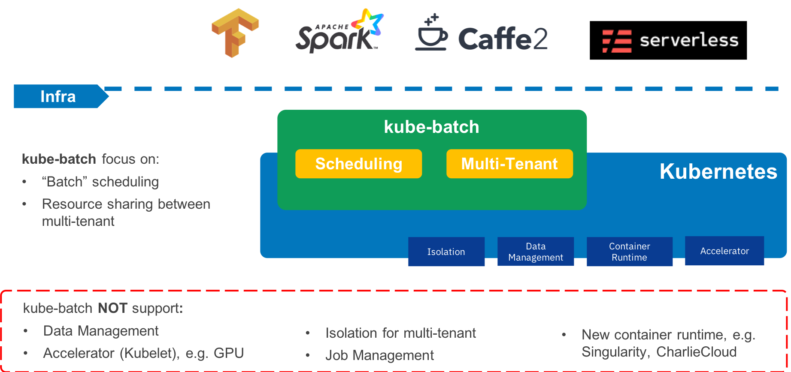

# kube-batch

- [kube-batch](#kube-batch)
  - [1.基础概念](#1基础概念)
  - [2.Actions](#2actions)
  - [3.plugins](#3plugins)
    - [3.1 Priority](#31-priority)
    - [3.2 Gang](#32-gang)
    - [3.3 Conformance](#33-conformance)
    - [3.4 DRF (Dominant　Resource　Fairness)](#34-drf-dominantresourcefairness)
    - [3.5 predication](#35-predication)
    - [3.6 nodeorder](#36-nodeorder)
    - [3.7 Proportion](#37-proportion)

kube-batch是在kubernetes之上的一个专注于做批处理的调度器，是volcano项目的前身。kube-batch提供了批调度(gang-schedule)的能力，来支撑各种大数据、AI框架运行在k8s上。volcano相对于kube-batch则完善了包括Controller、Admission等批处理生态组件。目前kube-batch已经处于不维护的状态，基本都切换到去对接使用volcano。我自己打算维护一个[分支](https://github.com/lowang-bh/kube-batch.git)尽量修复已知的一些问题，感兴趣的同学可以在上面试用,其设计理念值得我们学习。

下面对`kube-batch`的配置使用以及核心架构进行一些说明



配置文件

```yml
actions: "allocate, preempt, reclaim, backfill"
tiers:
- plugins:
    - name: priority
    - name: gang
    - name: conformance
- plugins:
    - name: drf
    - name: predicates
      arguments:
        predicate.MemoryPressureEnable: true
        predicate.DiskPressureEnable: true
        predicate.PIDPressureEnable: true    
    - name: proportion
    - name: nodeorder
```

## 1.基础概念

- actions: kube-batch一次调度过程中一次执行的主要流程，每个流程可以针对不同的功能进行自定义开发，每个流程会调用插件定义的算法
- plugin：自定义的一些调度算法，会在每一个actions中依次调用。每个插件中注册的算法可以通过配置文件开启或者关闭
- job：对应代码中的数据结构`JobInfo`, 包含一组pod的信息，和一个`PodGroup`一一对应
- PodGroup: 自定义crd，用来声明需要一起执行`gang-schedule`功能的pod的信息，包括队列名，最小副本数，优先级等
- Task: 对应代码中的数据结构`TaskInfo`, 对应一个`pod`
- Queue: 用来对不同租户进行资源划分和隔离的队列

## 2.Actions

- 2.1 Allocate
功能 : 将pod（task）分配到某个节点，会执行k8s中的预选和优选过程，即离不开`predicate`和`nodeorder`插件

- 2.2 Preempt
功能: 抢占已经调度了的满足条件的pod,并将目标pod调度上去，主要是同一个队列里面高优先级任务的task抢占低优先级任务的task，或者同一个job的高优先级task抢占低优先级task

    条件：满足`priority`, `gang-schedule`, `conformance`, `drf`插件中定义的`preeptable`条件:即 高优先级，可弹性(running>minMembers),非系统优先级别, share值比较

- 2.3 Reclaim
功能 : 主要在集群资源不够时，不同队列之间的任务抢占。当向`deserved`资源未使用完的队列中提交任务时，由于集群剩余资源无法满足任务运行，从而驱逐其他资源使用量(`allocated`)超过其`deserved`值的队列中的任务，来达到资源回收的目的

    条件： 满足`gang-schedule`, `comformance`和`Proportion`插件中定义的`ReclaimableFn`，前两个和preempt条件一样， `Proportion` 可召回需满足条件：召回pod的job所在的Queue分配资源仍然比配额大才召回

- 2.4 Backfill
功能 : 调度`BestEffort`类型(未设置资源使用量)的pod到节点

```go
// 先注册plungins, 然后执行action
ssn := framework.OpenSession(pc.cache, pc.plugins)
defer framework.CloseSession(ssn)
for _, action := range pc.actions {
    action.Execute(ssn)
}
```

## 3.plugins

OpenSession的时候注册每个plugin里面的函数

```go
for _, plugin := range ssn.plugins {
    plugin.OnSessionOpen(ssn)
}
```

### 3.1 Priority

作用：比较job和task的优先级

- taskOrderFn: taskPriority排序，也就是pod spec设置的优先级，如果相同，使用创建时间，ID排序
- jobOrderFn: JobPriority, podgroup中设置的优先级
- preemptableFn: JobPriority比较，只能抢占优先级低的job

### 3.2 Gang

作用：  

1. 给未处于ready状态的job更高的优先级，使其能尽快调度；  
2. 判断job是否可以被抢占

- validJobFn: job的valid任务不满足最小可用数（job.ValidTaskNum() < MinAvailable）
- reclaimableFns: job的ready任务数多于最小可用数 （MinAvailable <= job.ReadyTaskNum()-1）
- preemptableFn: 可抢占条件 MinAvailable <= job.ReadyTaskNum()-1）
- jobOrderFn: 为让未就绪的job尽快被调度到节点，定义了jobOrderFn ,未就绪的job拥有更高的优先级
- jobReadyFn: 用来判断一个job是否已经就绪（job.ReadyTaskNum() >= MinAvailable)
- jobPipelinedFn: ji.WaitingTaskNum() + ji.ReadyTaskNum() >= MinAvailable

### 3.3 Conformance

作用: conformance plugin认为命名空间kube-system下的任务具有更高的优先级。这些任务不能被抢占

- PreemptableFn：认为命名空间kube-system下的任务具有更高的优先级,这些任务不能被抢占。
- ReclaimableFn: 同上使用evictableFn

### 3.4 DRF (Dominant　Resource　Fairness)

作用：计算已分配资源的`share`值， 认为主导资源占用比例低(share值小)的任务具有高优先级

(注：DRF(Dominant Resource Fairness)，可参考[论文](https://cs.stanford.edu/~matei/papers/2011/nsdi_drf.pdf))

- preemptableFn: 按照`preemptor` 和`preemptees`的share值进行比较，`preemptor.share < preemptees.share`的将作为victim
- jobOrderFn: 按照share(allocated/total)值排序，share值越小，优先级越高
- 增加回调函数eventHandler：`AllocateFunc`和`DeallocateFunc`以更新DRF中对于job的share值

### 3.5 predication

作用： 预选策略，评估pod是否能调度到某一个节点

- AddPredicateFn: 部分k8s原生scheduler支持的predict

### 3.6 nodeorder

作用： 优选策略，对预选节点进行打分，选取最优节点

- priorityConfigs 优选函数回调列表

### 3.7 Proportion

作用: 实现了队列Queue: 根据各个队列声明的权重和全局的资源总量初始化`deserved`的值，根据全局的job初始化allocated和request的值, 并监听全局的资源释放和申请事件; `deserved`: `request` 和 `deserved` 两者取最小值

plugin function

- QueueOrderFn: 会决定哪一个队列里的job在调度时会被优先考虑,这里沿用了DRF处jobOrderFn的逻辑, share最小会最优先被考虑(share := helpers.Share(attr.allocated.Get(rn), attr.deserved.Get(rn)))
- OverusedFn: 判断queue的资源使用是否已经超出限制了，即 overused := attr.deserved.LessEqual(attr.allocated)
- ReclaimableFn: 判断一个task是否可以被召回，如果召回之后使得已经分配到的资源小于等于deserved就不应该被召回。
  
    ```go
    allocated.Sub(reclaimee.Resreq)
    if attr.deserved.LessEqual(allocated) {
        victims = append(victims, reclaimee)
    }
    ```

- AddEventHandler: `AllocateFunc`和`DeallocateFunc`更新share值
